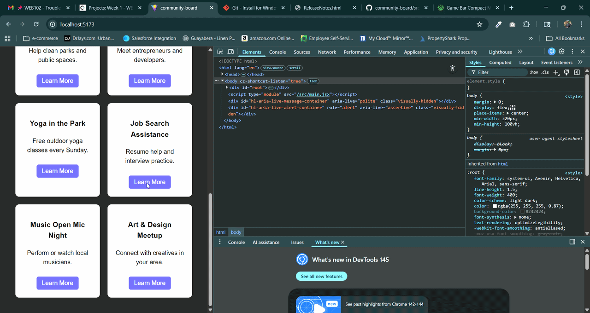

# Community Board

## Overview
This project is a **Community Events Board** that displays 10 unique events/resources in a responsive card layout. Each card includes event details and links for more information.

---

## 🎯 Features Checklist

- [x] Initialize a new React application with Vite  
- [x] Created functional React components (`App.jsx` includes Card component)
- [x] Props passed to components correctly  
- [x] CSS styling applied to components  
- [x] At least 10 unique events/resources displayed  
- [x] Cards displayed in an organized grid format  
- [x] Header/title describing the theme displayed  
- [x] Responsive layout tested on mobile (see GIF below)  
- [x] Buttons/links included on each card  

---

## 📸 GIF Walkthrough

> Demonstrates the board working on both desktop and mobile views.

---

## 📝 Notes
- All project files are committed and pushed to GitHub.  
- The app is fully functional and ready for submission.